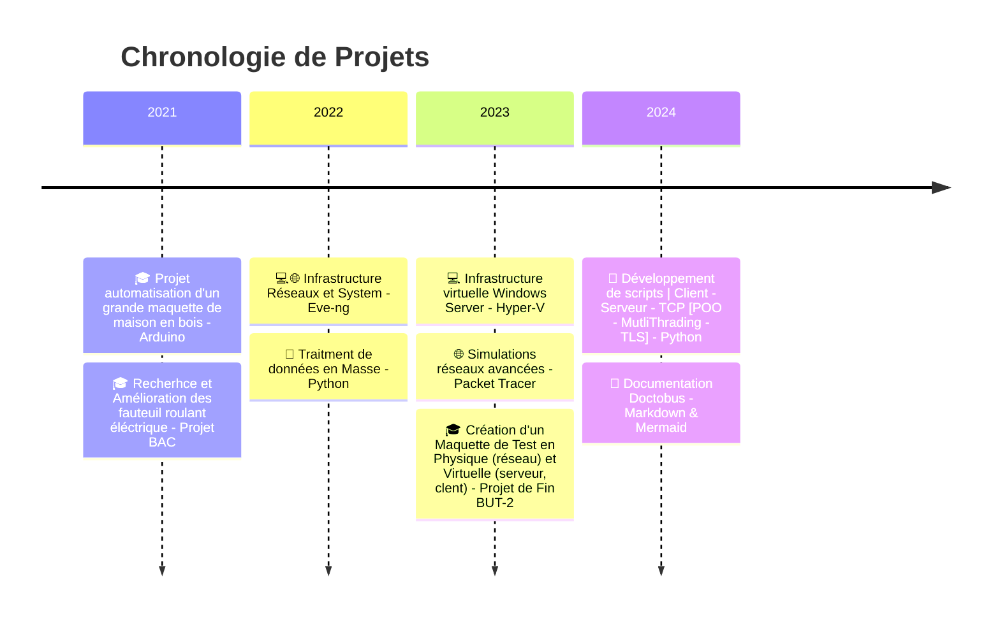

# 👋**Bienvenue sur Mon Profil GitHub !**

---

## 🧑‍💻 À propos de moi

Bonjour, je suis `Coucou74` !  
Je suis passionné par la **technologie réseau**, les **systèmes**, la **sécurité** et le **développement d'outils et de scripts**. 🚀

### 🎯 Points clés :

- **Nom d'utilisateur GitHub** : Coucou74
- **Passions** :
  - 🌐 Configuration Réseau (Switchs, Routeurs)
  - 🖥️ Configuration Système (AD, DNS, DHCP ...)
  - 👨‍💻 Programmation (Python, Bash, PowerShell)
  - 🛡️ Sécurité Informatique (Firewall, VPN)

---

## 🛠️ Outils et Technologies

| 🛠️ **Outils**         | 📝 **Description**                         |
|------------------------|--------------------------------------------|
| 🖥️ **JetBrains IDEs** | PyCharm, PhpStorm, WebStorm                |
| 🐳 **Virtualisation**  | Docker, VMware, VirtualBox                 |
| 🌐 **Réseaux**         | Wireshark                                  |
| 👾 **Simulations**     | GNS3, EVE-NG, Packet Tracer                |
| 🔧 **Collaboration**   | Git, GitHub                                |
| 📚 **Documentation**    | Markdown, mermaid                          |

---

## 🖧 Mon univers Réseau

- 🔌 **Switchs** : Cisco, Ubiquiti ...
- 📡 **Routeurs** : Cisco, MikroTik ...
- 🔥 **Firewalls** : PFSense, Fortinet, Stormshield ...
- 📶 **Points d'accès Wifi** : Ubiquiti, Cisco ...
- 📊 **Supervision** : Grafana, Zabbix ...

---

## Mes Préférences
- **Langage favori** : 🐍 Python
- **Éditeur de texte** : 🧠 JetBrains IDEs
- **Versioning** : 📦 Git & GitHub
- **Documentation** : 📚 Markdown et mermaid
- **Virtualisation** : 🐳 Docker

## 🎯 Mes Projets en Détails

---

    <h1>📬 Contact</h1>
    💌 <strong> Email </strong> : mayeul_brochier@hotmail.com  
     
    🔗 <strong> LinkedIn </strong>: www.linkedin.com/in/mayeul-brochier-904317255
     
     
    <strong> Merci d’avoir visité mon profil GitHub ! 🌟 </strong>

